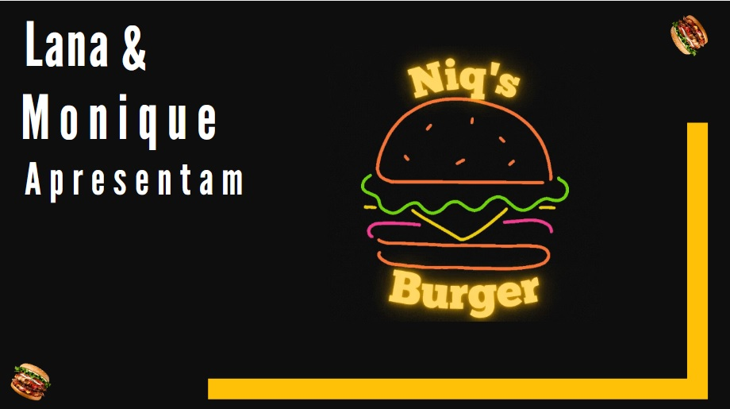
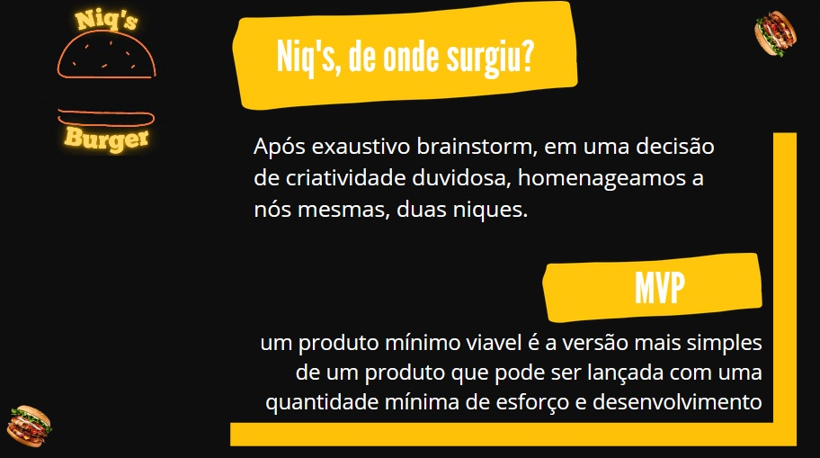
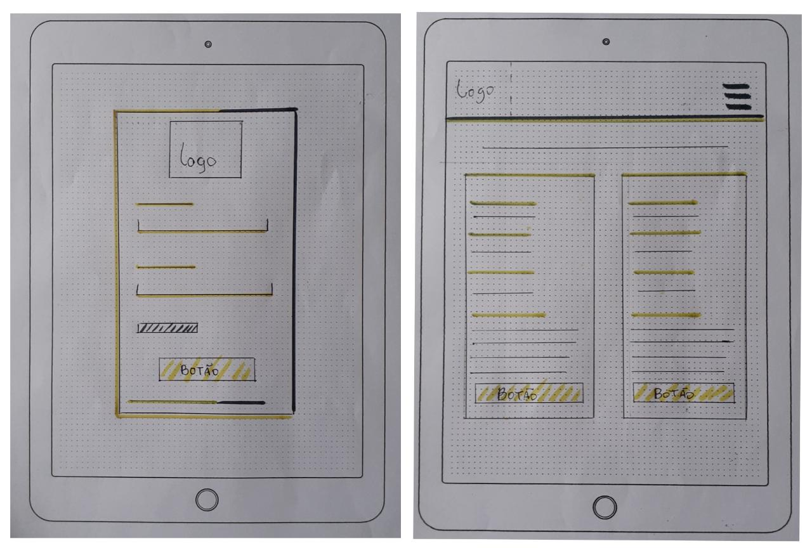
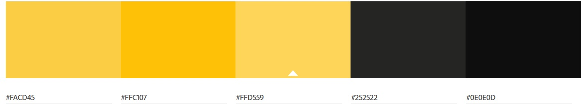

## :round_pushpin: Índice

- [1. Sobre o projeto](#1-sobre-o-projeto)
- [2. Histórias de usuários](#2-histórias-de-usuários)
- [3. Layout](#3-layout)
- [4. Experiência dos usuários](#4-experiência-dos-usuários)
- [5. Autoras](#5-autoras)

---

## 1. Sobre o projeto :computer:

Niq's burger é um pequeno restaurante de hambúrgueres, que está crescendo, e necessitava uma interface para realizar pedidos utilizando um tablet, e enviá-los para a cozinha para que sejam preparados de forma ordenada e eficiente.

O projeto foi realizado no _bootcamp_ da [LABORATÓRIA](https://www.laboratoria.la/br).
Acesse aqui o [Niq's Burger](//colocarlink) :computer_mouse:

## 2. Histórias de usuários :receipt:

Uma história do usuário é uma explicação informal e geral sobre um recurso de software escrita a partir da perspectiva do usuário final. Seu objetivo é articular como um recurso de software pode gerar valor para o cliente.

**Primeira História de Usuário**

> Eu, como admin quero cadastrar meus funcionarios.
> Eu, como garçom/garçonete quero entrar no sistema de pedidos.

**Segunda História de Usuário**

> Eu como garçom/garçonete quero poder anotar o pedido de um cliente para não depender da minha memória, saber quanto cobrar e poder enviar os pedidos para a cozinha para serem preparados em ordem.

**Terceira História de Usuário**

> Eu como chefe de cozinha quero ver os pedidos dos clientes em ordem, poder marcar que estão prontos e poder notificar os garçons/garçonetes que o pedido está pronto para ser entregue ao cliente.

**Quarta História de Usuário**

> Eu como garçom/garçonete quero ver os pedidos que estão prontos para entregá-los rapidamente aos clientes.

## 3. Layout :art:

### Protótipo de baixa fidelidade :floppy_disk:

Um website nada mais é que um produto, dessa forma é muito importante o processo de construção do mesmo.
Após as definições das necessidades dos usuários e pensando em sua experiencia com o produto, foram feitos os primeiros esboços dos esqueletos do site. Seguindo o requisito proposto pelo projeto, nosso Wireframe é considerado de Baixa Fidelidade, foi construido manualmente, com lápis e papel.
Os desenhos foram feitos já pensando na responsividade da tela, e projetados primeiramente para Tablet.
Abaixo temos um exemplo das telas de login e pedidos versão tablet.

   

### Paleta de cores :red_circle: :black_circle:

Para o layout, pensamos em uma paleta de cores que remete a modernidade, juventude e minimalismo. Com a preocupação de ser misturas equilibradas, o uso dos tons mais escuros, como as cores principais no feed permite explorar diferentes texturas e principalmente o balanço de luz e sombra. O tom amarelo facilita a identificação com Pura energia e alegria, simboliza a riqueza e estimula a criatividadee. O cinza, uma cor considerada neutra, transmite a sensação de solidez, formalidade e modernidade, além, claro, de ser um tom agradável.

### Demonstração da Aplicação :file_folder:

Por meio de gifs vamos demonstrar a usabilidade do nosso produto em formato Desktop e, Tablet:

**Demonstração pagina de cadastro**

   

**Demonstração login e menu**

   

**Demonstração pedidos prontos tablet**

   

**Demonstração funcionalidades cozinha tablet**

   

## 4. Experiência dos usuários :right_anger_bubble:

#### Testes de usabilidade

A cada entrega de funcionalidade fizemos testes de usabilidade com alguns usuários. A partir desses testes verificamos a necessidade de melhoramos o design da aplicação, padronizando as fontes e cores do feed, proporcionando assim uma experência visual mais agradável para os usuários.

## 7. Autoras :woman_technologist:

### Lana Souza :woman_artist:

[@lanizia](https://github.com/lanizia) [Linkedin](https://www.linkedin.com/in/monique-doretto/)

### Monique :woman_artist:

[@tenorionique](https://github.com/tenorionique) [Linkedin](https://www.linkedin.com/in/lanamsouza/)

---

Acesse aqui o [Niqs Burger](//colocarlink) :computer_mouse:
